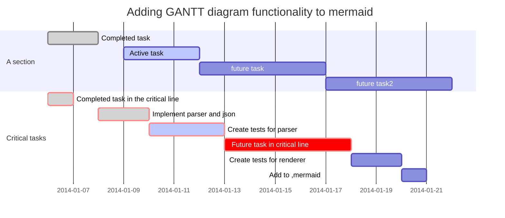
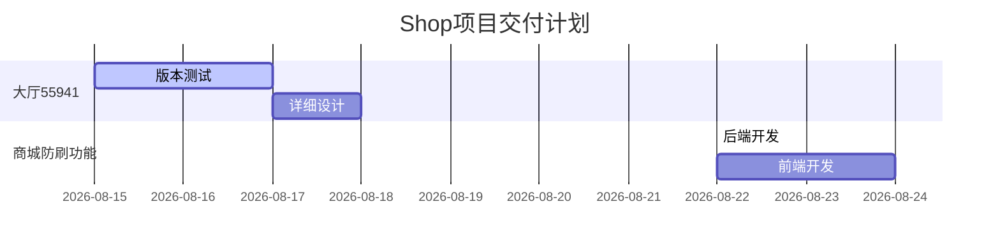
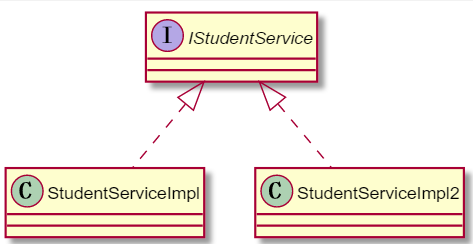

<!-- TOC -->

- [1.一级缓存](#1一级缓存)
- [2.二级缓存](#2二级缓存)
- [3.使用Ehache](#3使用ehache)
- [4.关于缓存的补充说明](#4关于缓存的补充说明)

<!-- /TOC -->

# 1.一级缓存
​ MyBatis 默认开启了一级缓存，一级缓存是在SqlSession 层面进行缓存的。即，**同一个SqlSession ，多次调用同一个Mapper和同一个方法的同一个参数，只会进行一次数据库查询**，然后把数据缓存到缓冲中，以后直接先从缓存中取出数据，不会直接去查数据库。
**当一级缓存中存在目标数据时，会优先从一级缓存中取出数据。如果一级缓存中没有目标数据，再去二级缓存中拿。**
**一级缓存:** 基于PerpetualCache 的 HashMap本地缓存，其存储作用域为 SqlSession，当 SqlSession flush 或 close 之后，该Session中的所有 Cache 就将清空。
例子如下：
```java
    @Test
    public void testCache(){
        NewsLabel newsLabel = dao.selectById(1);
        System.out.println(newsLabel);

        NewsLabel newsLabel1 = dao.selectById(1);
        System.out.println(newsLabel1);
    }
```
```log
00:09:17.679 [main] DEBUG dao.INewsLabelDao - Cache Hit Ratio [dao.INewsLabelDao]: 0.0
00:09:18.063 [main] DEBUG dao.INewsLabelDao.selectById - ==>  Preparing: select * from t_news where id=? 
00:09:18.110 [main] DEBUG dao.INewsLabelDao.selectById - ==> Parameters: 1(Integer)
00:09:18.157 [main] DEBUG dao.INewsLabelDao.selectById - <==      Total: 1
NewsLabel{id=1, newsname='娱乐新闻', children=null, pid=0}
00:09:18.163 [main] DEBUG dao.INewsLabelDao - Cache Hit Ratio [dao.INewsLabelDao]: 0.0
NewsLabel{id=1, newsname='娱乐新闻', children=null, pid=0}
```
从上面的例子中可以看到，由于一级缓存中已经存在了目标数据，不必去二级缓存中找，故而，第二次查询的缓存命中率为0。（注：mybatis的log中不会打印一级缓存命中率）

# 2.二级缓存
**二级缓存与一级缓存其机制相同，默认也是采用 PerpetualCache，HashMap存储，不同在于其存储作用域为 Mapper(Namespace)，并且可自定义存储源，如 Ehcache。**
**对于缓存数据更新机制，当某一个作用域(一级缓存Session/二级缓存Namespaces)的进行了 C/U/D 操作后，默认该作用域下所有 select 中的缓存将被clear。**
```java
    @Test
    public void testCache(){
        NewsLabel newsLabel = dao.selectById(1);
        System.out.println(newsLabel);
        sqlSession.close();

        //sqlSession已经close了，所以要重新获取sqlSession对象
        sqlSession = SessionFactory.getSqlSession();
        //重新获取dao对象
        dao = sqlSession.getMapper(INewsLabelDao.class);
        NewsLabel newsLabel1 = dao.selectById(1);
        System.out.println(newsLabel1);
    }
```
可以看到，此时二级缓存生效了。并且其命中率为0.5
```log
00:24:51.252 [main] DEBUG dao.INewsLabelDao - Cache Hit Ratio [dao.INewsLabelDao]: 0.0
00:24:51.618 [main] DEBUG dao.INewsLabelDao.selectById - ==>  Preparing: select * from t_news where id=? 
00:24:51.670 [main] DEBUG dao.INewsLabelDao.selectById - ==> Parameters: 1(Integer)
00:24:51.722 [main] DEBUG dao.INewsLabelDao.selectById - <==      Total: 1
NewsLabel{id=1, newsname='娱乐新闻', children=null, pid=0}
00:24:51.733 [main] DEBUG dao.INewsLabelDao - Cache Hit Ratio [dao.INewsLabelDao]: 0.5
NewsLabel{id=1, newsname='娱乐新闻', children=null, pid=0}
```

# 3.使用Ehache

pom.xml 需要引入ehcache以及mybatis-ehcache
```xml
        <dependency>
            <groupId>net.sf.ehcache</groupId>
            <artifactId>ehcache</artifactId>
            <version>2.10.1</version>
        </dependency>
        <dependency>
            <groupId>org.mybatis.caches</groupId>
            <artifactId>mybatis-ehcache</artifactId>
            <version>1.1.0</version>
        </dependency>
```
mybaits.xml 开启二级缓存配置
```xml
    <settings>
        <!-- 使用LOG4J2记录日志 -->
        <setting name="logImpl" value="LOG4J2"/>
        <!-- 开启二级缓存 -->
        <setting name="cacheEnabled" value="true"/>
    </settings>
```
mapper.xml  在mapper中指定使用Ehcache做二级缓存
```xml
<cache type="org.mybatis.caches.ehcache.EhcacheCache"/>
```
ehcache.xml  配置详情
```xml
<ehcache xmlns:xsi="http://www.w3.org/2001/XMLSchema-instance" xsi:noNamespaceSchemaLocation="">
    <diskStore path="java.io.tmpdir"/>
    <defaultCache
        maxElementsInMemory="10000"
        eternal="false"
        timeToIdleSeconds="120"
        timeToLiveSeconds="120"
        maxElementsOnDisk="10000000"
        diskExpiryThreadIntervalSeconds="120"
        memoryStoreEvictionPolicy="LRU">
    <persistence strategy="localTempSwap"/>
    </defaultCache>
</ehcache>
```
# 4.关于缓存的补充说明
1. 映射语句文件中的所有select语句将会被缓存。
2. 映射语句文件中的所有insert，update和delete语句会刷新缓存。
3. 缓存会使用Least Recently Used（LRU，最近最少使用的）算法来收回。
4. 缓存会根据指定的时间间隔来刷新。
5. 缓存会存储1024个对象
   
cache标签常用属性如下
```xml
<cache 
eviction="FIFO"  <!--回收策略为先进先出-->
flushInterval="60000" <!--自动刷新时间60s-->
size="512" <!--最多缓存512个引用对象-->
readOnly="true"/> <!--只读-->
```




<div>


<div>
<style>
.center {
    text-align:center;
}
</style>