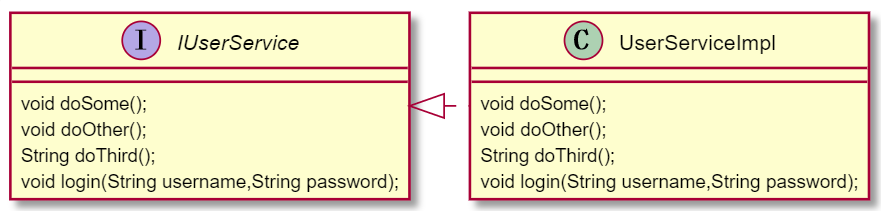
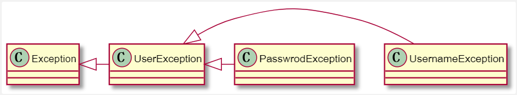

# 1 springAOP
在开始介绍之前首先介绍下，相关术语
```
Aspect(切面)：与主业务逻辑无关的demo，比如：事务处理、log处理等均可以理解为切面 。
Weaving(织入)：织入就是将切面代码加入到主业务逻辑当中。
JoinPoint（连接点）：连接点指的是可以被切面织入的方法。通常是业务逻辑接口的方法均为连接点。
PointCut（切入点）：切入点指的是切面具体织入的方法。另外：被标记为final的方法是不能作为连接点与切入点的。因为它不能修改。
Target（目标对象）。指的是将要被增强的对象。即为包含主业务逻辑的对象。
Advice(通知)：是切面点的一种实现。可以完成简单的织入功能。
Advisor(顾问)：是对通知的包装，可以实现更为复杂的功能。
```
# 1.1 前置通知
实现方式一：
需要切面类实现接口MethodBeforeAdvice
```java
public class MyMethodBeforeAdvice implements MethodBeforeAdvice{
    /**
     *
     * @param method 目标方法
     * @param args 目标方法的参数
     * @param target 目标对象
     * @throws Throwable 异常
     */
    public void before(Method method, Object[] args, Object target) throws Throwable {
        System.out.println("执行前置通知方法");
    }
}
```
并在spring-config.xml注册该切面
```xml
 <!--注册切面：前置通知-->
 <bean id="myAdvice" class="com.pactera.aop.MyMethodBeforeAdvice"/>
```
有了切面之后，则需要在spring-config.xml文件中注册切入点，以及相关的代理方法。
```xml
<!--注册目标对象-->
<bean id="userService" class="com.pactera.service.UserServiceImpl"/>
<bean id="serviceProxy" class="org.springframework.aop.framework.ProxyFactoryBean">
    <!--目标对象-->
    <property name="target" ref="userService"/>
     <!--或者是用 targetName-->
    <!--<property name="targetName" value="userService"/>-->
    <!--切面,可同时使用多个切面-->
    <property name="interceptorNames" value="myAdvice"/>
</bean>
```
serviceProxy中的target属性指定目标对象。interceptorNames则指定了用哪个切面
UserSeviceImpl的类图如下：

java类demo如下
```java
public class UserServiceImpl implements IUserService {
    public void doSome() {
        System.out.println("doSome.....");
    }

    public void doOther() {
        System.out.println("doOther....");
    }

    public String doThird() {
        String result="abced";
        System.out.println("doThird....");
        return result;
    }

    public void login(String username, String password) throws UserException {
        if(!username.equals("username")){
            throw new UsernameException("用户名不对");
        }
        if(!password.equals("password")){
            throw  new PasswordException("密码不对");
        }
    }
}
```
# 1.2 后置通知
实现方法一：
后置通知则需要切面类实现AfterReturningAdvice接口
```java
public class MyAfterReturnAdvice implements AfterReturningAdvice {
    /**
     *
     * @param returnValue 目标方法的返回值
     * @param method 目标方法
     * @param args 目标方法的参数
     * @param target 目标对象
     * @throws Throwable 抛出异常
     */
    public void afterReturning(Object returnValue, Method method, Object[] args, Object target) throws Throwable {
        if(returnValue!=null){
            System.out.println("执行后置通知方法:returnValue  "+returnValue.toString().toUpperCase());
        }else{
            returnValue=5;
            System.out.println("执行后置通知方法 returnValue默认值："+returnValue);
        }
    }
}
```
spirng-config.xml中配置如下
```xml
<bean id="userService" class="com.pactera.service.UserServiceImpl"/>
<!-- 注册切面：前置通知 -->
<bean id="myAdvice" class="com.pactera.aop.MyMethodBeforeAdvice"/>
<!-- 注册切面：后置通知 -->
<bean id="afterAdvice" class="com.pactera.aop.MyAfterReturnAdvice"/>
<bean id="serviceProxy" class="org.springframework.aop.framework.ProxyFactoryBean">
    <!--目标对象-->
    <property name="target" ref="userService"/>
    <!--或者是用 targetName-->
    <!--<property name="targetName" value="userService"/>-->
    <!--切面,可同时使用多个切面-->
    <property name="interceptorNames" value="myAdvice,afterAdvice"/>
</bean>
```
# 1.3 环绕通知
环绕通知需实现MethodInterceptor。**与上面两种通知不同的是，环绕通知可以修改方法的返回值！**
```java
public class MyMethodInterceptor implements MethodInterceptor {

    public Object invoke(MethodInvocation methodInvocation) throws Throwable {
        System.out.println("执行环绕通知：目标方法执行之前");
        //执行目标方法
        Object result= methodInvocation.proceed();
        System.out.println("执行环绕通知：目标方法执行之后");
        if(result!=null){
            result=result.toString().toUpperCase();
        }
        return result;
    }
}
```
xml中配置如下
```xml
<bean id="userService" class="com.pactera.service.UserServiceImpl"/>
<!-- 注册切面：前置通知 -->
<bean id="myAdvice" class="com.pactera.aop.MyMethodBeforeAdvice"/>
<!-- 注册切面：后置通知 -->
<bean id="afterAdvice" class="com.pactera.aop.MyAfterReturnAdvice"/>
<!--注册切面：环绕通知-->
<bean id="interceptorAdvice" class="com.pactera.aop.MyMethodInterceptor"/>
<!--生成代理对象-->
<bean id="serviceProxy" class="org.springframework.aop.framework.ProxyFactoryBean">
    <!--目标对象-->
    <property name="target" ref="userService"/>
    <!--或者是用 targetName-->
    <!--<property name="targetName" value="userService"/>-->
    <!--切面,可同时使用多个切面-->
    <property name="interceptorNames" value="myAdvice,afterAdvice,interceptorAdvice"/>
</bean>
``` 
# 1.4 异常通知
发生特定异常时，用来处理特定异常的通知。它需要实现ThrowsAdvice
```java
public class MyThrowsAdvice implements ThrowsAdvice {
    //当目标方法抛出与指定异常具有is-a 关系时
    public void afterThrowing(Exception e){
        System.out.println("发生异常了！"+e.getMessage());
    }
    public void afterThrowing(UserException e){
        System.out.println("输入用户发生异常了"+e.getMessage());
    }
}
```
这里自定义了三个异常，分别是UserException,UsernameException,PasswordException,其类图如下

spring-config.xml注册如下：
```xml
<!--注册目标对象-->
<bean id="userService" class="com.pactera.service.UserServiceImpl"/>
<!--注册切面：前置通知-->
<bean id="myAdvice" class="com.pactera.aop.MyMethodBeforeAdvice"/>
<!--注册切面：后置通知-->
<bean id="afterAdvice" class="com.pactera.aop.MyAfterReturnAdvice"/>
<!--注册切面：环绕通知-->
<bean id="interceptorAdvice" class="com.pactera.aop.MyMethodInterceptor"/>
<!--注册切面：异常通知-->
<bean id="myExceptionAdvice" class="com.pactera.aop.MyThrowsAdvice"/>
<!--生成代理对象-->
<bean id="serviceProxy" class="org.springframework.aop.framework.ProxyFactoryBean">
    <!--目标对象-->
    <property name="target" ref="userService"/>
    <!--或者是用 targetName-->
    <!--<property name="targetName" value="userService"/>-->
    <!--切面,可同时使用多个切面-->
    <property name="interceptorNames" value="myAdvice,afterAdvice,interceptorAdvice,myExceptionAdvice"/>
    
</bean>
```
```java
 public void testAop(){
        ApplicationContext ctx = new ClassPathXmlApplicationContext("spring-config.xml");
       IUserService userService = (IUserService)ctx.getBean("serviceProxy");
       userService.doOther();
        System.out.println("============");
       userService.doSome();
        System.out.println("=============");
        String s = userService.doThird();
        //输出环绕通知修改后的结果
        System.out.println("doThird的结果为"+s);
        try{
            userService.login("username","password1");
        }catch (UserException e){
            System.out.println();
        }
    }
```
综合上述所有通知，测试类输出结果如下：
```log
执行前置通知方法
执行环绕通知：目标方法执行之前
doOther....
执行环绕通知：目标方法执行之后
执行后置通知方法 returnValue默认值：5
============
执行前置通知方法
执行环绕通知：目标方法执行之前
doSome.....
执行环绕通知：目标方法执行之后
执行后置通知方法 returnValue默认值：5
=============
执行前置通知方法
执行环绕通知：目标方法执行之前
doThird....
执行环绕通知：目标方法执行之后
执行后置通知方法:returnValue  ABCED
doThird的结果为ABCED
执行前置通知方法
执行环绕通知：目标方法执行之前
输入用户发生异常了密码不对
```