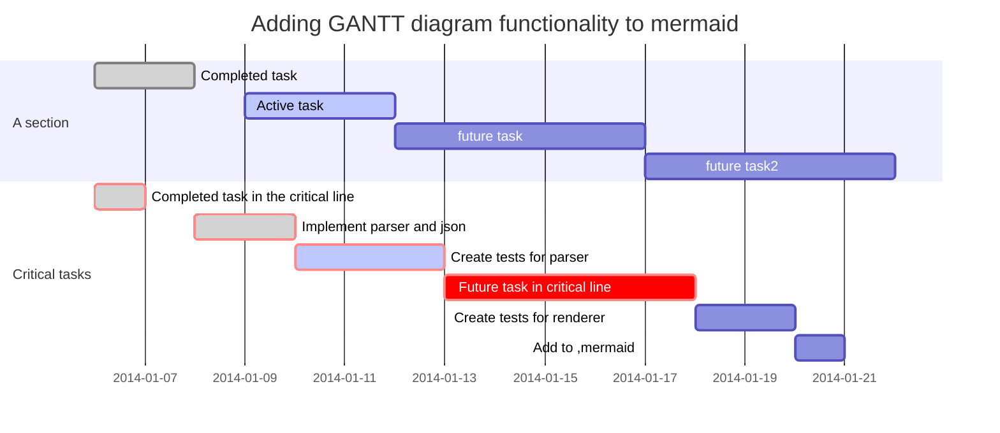

<!-- TOC -->

- [1. resultType和resultMap](#1-resulttype%E5%92%8Cresultmap)
    - [1. reslutType](#1-resluttype)
    - [1.2 reslutMap](#12-reslutmap)
    - [1.2 reslutMap](#12-reslutmap)
- [2.动态Sql](#2%E5%8A%A8%E6%80%81sql)
    - [2.1 if语句](#21-if%E8%AF%AD%E5%8F%A5)
    - [2.2 where](#22-where)
    - [2.3 choose](#23-choose)
    - [2.4 foreach](#24-foreach)

<!-- /TOC -->
### 1. resultType和resultMap
#### 1. reslutType
  resultType：查询的返回结果类型。可以是基本数据类型比如Interger，也可以是java.util.Map，java.util.List等类型，也可以是实体类类型。
  ```xml
<select id="selectAll" resultType="Student">   
     select id,stu_name stuName,score from t_student
</select>
```
#### 1.2 reslutMap
  reslutMap:用于处理java实体类属性与数据库中列名不对应的问题。
  比如：java实体类：
  ``` java
    public class Student {
    private Integer id;
    private String stuName;
    private Double score;
    //省略get、set方法
    public Student(Integer id, String stuName, Double score) {
        this.id = id;
        this.stuName = stuName;
        this.score = score;
    }
}
```
数据库字段：
``` sql
CREATE TABLE `t_student`  (
  `id` int(11) NOT NULL AUTO_INCREMENT,[TOC]
### 1. resultType和resultMap

#### 1.1 reslutType
  resultType：查询的返回结果类型。可以是基本数据类型比如Interger，也可以是java.util.Map，java.util.List等类型，也可以是实体类类型。
  ```xml
<select id="selectAll" resultType="Student">   
     select id,stu_name stuName,score from t_student
</select>
```
#### 1.2 reslutMap
  reslutMap:用于处理java实体类属性与数据库中列名不对应的问题。
  比如：java实体类：
  ``` java
    public class Student {
    private Integer id;
    private String stuName;
    private Double score;
    //省略get、set方法
    public Student(Integer id, String stuName, Double score) {
        this.id = id;
        this.stuName = stuName;
        this.score = score;
    }
}
```
数据库字段：
``` sql
CREATE TABLE `t_student`  (
  `id` int(11) NOT NULL AUTO_INCREMENT,
  `stu_name` varchar(10) CHARACTER SET utf8 COLLATE utf8_bin NULL DEFAULT NULL,
  `score` double(4, 2) NULL DEFAULT NULL,
  PRIMARY KEY (`id`) USING BTREE
) ENGINE = InnoDB AUTO_INCREMENT = 15 CHARACTER SET = utf8 COLLATE = utf8_bin ROW_FORMAT = Dynamic;
SET FOREIGN_KEY_CHECKS = 1;
```
java实体类中属性名stuName与db中stu_name不一致。这导致了如果直接使用
```xml
<select id="selectAll" resultType="Student">   
    select id,stu_name ,score from t_student
</select>
```
查询时，结果集返回的students对象的stuName=null。
此时的解决方法有两个：
1、使用别名，将stu_name 的别名设置成stuName（适用于仅有个别字段不一致的情况）
```xml
    <select id="selectAll" resultType="Student">
        select id,stu_name stuName ,score from t_student
     </select>
```
2、使用resultMap映射（适用于有很多字段不一致的情况）
resultMap.id:映射ID，resultMap.type：实体类全路径名
id:主键。column:数据库列名，property：实体类属性名
```xml
   <resultMap id="studentMap" type="com.pactera.entiy.Student">
        <id column="id"  property="id"/>
        <result column="stu_name" property="stuName"/>
        <!--当实体类属性名==数据库列名时，可不比加入到resultMap中-->
        <!--<result column="score" property="score"/>-->
    </resultMap>
```
配置了resultMap可以这样使用：
```xml
    <select id="selectAll2" resultType="Student" resultMap="studentMap">
        select * from t_student
    </select>
```
### 2.动态Sql
#### 2.1 if语句
   需求：查询满足用户提交查询条件的所有学生。用户提交的查询条件可以包含一个姓名的模糊查询，同时还可以包含一个年龄的下限。当然，用户在提交表单时可能给两个条件均作出了设定，也可能两个条件均不做设定，也可以只做其中一种设定。
   这引发的问题是，查询条件不确定时，查询条件依赖于用户提交的内容。

```xml
 <select id="selectByIf" resultMap="studentMap" resultType="Student">
        select id,stu_name,score
        from t_student
        where
        <if test="stuName !=null and stuName != '' ">
            stu_name like '%' #{stuName} '%'
        </if>
        <if test="score &gt; 0">
           and  score &lt;= #{score}
        </if>
 </select>
```
  当有两个输入条件都满足时，上面的demo自然无错。但是，当用户仅输入成绩时，问题又随之而来了。此时查询语句变成了：
  ```sql
      select   id,stu_name,score
      from t_student
      where
     and  score &lt;= #{score}
```
显然，此时的sql语句是错误的。log中表述如下：
```log
14:28:20.775 [main] DEBUG com.pactera.dao.IStudentDao.selectByIf - ==>  Preparing: select id,stu_name,score from t_student where and score <= ?  //问题出在这里
14:28:20.795 [main] DEBUG com.pactera.dao.IStudentDao.selectByIf - ==> Parameters: 95.5(Double)

org.apache.ibatis.exceptions.PersistenceException:
### Error querying database.  Cause: java.sql.SQLSyntaxErrorException: You have an error in your SQL syntax; check the manual that corresponds to your MySQL server version for the right syntax to use near 'and  score <= 95.5' at line 7
### The error may exist in mapper.xml
### The error may involve defaultParameterMap
### The error occurred while setting parameters
### SQL: select id,stu_name,score         from t_student         where                                 and  score <= ?
### Cause: java.sql.SQLSyntaxErrorException: You have an error in your SQL syntax; check the manual that corresponds to your MySQL server version for the right syntax to use near 'and  score <= 95.5' at line 7
```
#### 2.2 where
为了解决上述问题，mybatis引入了where语句。
```xml
<select id="selectByIf" resultMap="studentMap" resultType="Student">
    select id,stu_name,score
    from t_student
    <!--  有where标签时需要去掉sql中的where-->
    <where>
    <if test="stuName !=null and stuName != '' ">
         stu_name like '%' #{stuName} '%'
    </if>
    <if test="score &gt; 0">
        and score &lt;= #{score}
    </if>
    </where>
</select>
```
执行java代码，查看控制台相关消息：
```java
@Test
    public void testSelectByIf(){
        Student stu= new Student("", 95.5);
        List<Student> students = dao.selectByIf(stu);
        for(Student student:students) {
            System.out.println(student);
        }
        sqlSession.close();
    }
```
```log
    14:38:24.705 [main] DEBUG com.pactera.dao.IStudentDao.selectByIf - ==>  Preparing: select id,stu_name,score from t_student WHERE score <= ?
14:38:24.725 [main] DEBUG com.pactera.dao.IStudentDao.selectByIf - ==> Parameters: 95.5(Double)
14:38:24.741 [main] TRACE com.pactera.dao.IStudentDao.selectByIf - <==    Columns: id, stu_name, score
14:38:24.741 [main] TRACE com.pactera.dao.IStudentDao.selectByIf - <==        Row: 9, 邓可凡, 68.5
14:38:24.769 [main] TRACE com.pactera.dao.IStudentDao.selectByIf - <==        Row: 10, 邓邓张, 95.5
14:38:24.769 [main] TRACE com.pactera.dao.IStudentDao.selectByIf - <==        Row: 11, 邓张凡, 77.0
14:38:24.770 [main] TRACE com.pactera.dao.IStudentDao.selectByIf - <==        Row: 12, 邓凡张, 59.5
14:38:24.770 [main] TRACE com.pactera.dao.IStudentDao.selectByIf - <==        Row: 13, 邓可凡, 66.6
14:38:24.770 [main] TRACE com.pactera.dao.IStudentDao.selectByIf - <==        Row: 14, 邓可凡, 66.6
14:38:24.770 [main] DEBUG com.pactera.dao.IStudentDao.selectByIf - <==      Total: 6
Student{id=9, stuName='邓可凡', score=68.5}
Student{id=10, stuName='邓邓张', score=95.5}
Student{id=11, stuName='邓张凡', score=77.0}
Student{id=12, stuName='邓凡张', score=59.5}
Student{id=13, stuName='邓可凡', score=66.6}
Student{id=14, stuName='邓可凡', score=66.6}
```

由于“>" "<" 此类字符与xml的开始、结束标记冲突，所以需要使用转义字符：

#### 2.3 choose
需求：若姓名不为空，则按照姓名查询；若姓名为空，则按照年龄查询。若没有查询条件，则查询所有。
choose标签的作用跟java中switch...case功能相似。
```xml
    <choose>
        <when test=“满足条件1”>
                 //doSomething
                 //break;
        </when>
         <when test=“满足条件2”>
                  //doSomething
                 //break;
        </when>
         <when test=“满足条件3”>
                 //doSomething
                 //break;
        </when>
        <otherwise>
               //如果上述条件都不满足，
               //doDefalut
               //相当于switch..case中的defalut语句。
        </otherwise>
    </choose>
```
#### 2.4 foreach
1、遍历数组
```xml
    <select id="selectByForEachArray" resultMap="studentMap" resultType="Student">
        select * from t_student
        <if test="array.length>0">
            where id in
            <foreach collection="array" item="item" open="(" close=")" separator=",">
                #{item}
            </foreach>
        </if>
    </select>
```
此处相当于sql语句：
```sql
    select * form t_student where id in (?,?.....)
```
foreach 标签中的collection表示要遍历的集合的类型，一般有list，array，map等。
item：表示遍历到当前对象时，该对象的别名（名称）
open,close,separator用于拼接字符串。
相应的java代码
```java
        @Test
    public void testSelectByForEachArray(){
        int [] ids={9,10};
        List<Student> students = dao.selectByForEachArray(ids);
        for(Student student:students) {
            System.out.println(student);
        }
        sqlSession.close();
    }
```
2、遍历list
从这个实例中可以发现，在#{}中，可以是用 obj.element的形式来获取值
```xml
   <select id="selectByForEachList" resultType="Student" resultMap="studentMap">
        select * from t_student
        <if test="list.size>0">
            where id in
            <foreach collection="list" item="student" open="(" close=")" separator=",">
                //obj.elem
                #{student.id}
            </foreach>
        </if>
    </select>
```
相应java代码：
```java
    	@Test
    public void testSelectByForEachList(){
        Student s1 = new Student(12,"李朝宇", 95.5);
        Student s2 = new Student(13, "邓可凡", 96.1);
        ArrayList<Student> list = new ArrayList<Student>();
        list.add(s1);
        list.add(s2);
        List<Student> students = dao.selectByForEachList(list);
        for(Student student:students) {
            System.out.println(student);
        }
        sqlSession.close();
    }
```
&emsp;&emsp;各集合映射如下:
| 别名 |类型| 别名 |类型  |
| --- | --- | --- | --- |
| string|String| byte |Byte  |
| long |Long  |short  |Short  |
| list |List  |map  |Map  |
| array |数组  |collection  |Collection  |



@startuml
interface IStudentService
class StudentServiceImpl
class StudentServiceImpl2
IStudentService <|..StudentServiceImpl
IStudentService <|..StudentServiceImpl2
@enduml
